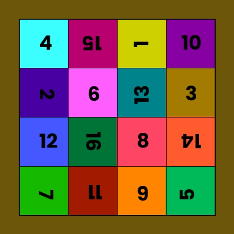

# ImageEncoder


## Overview

In today's digital age, privacy and security are paramount concerns. We often share images that we don't want to be accessible to just anyone. Whether it's personal photos or sensitive documents, ImageEncoder is the app you need to safeguard your visual content. ImageEncoder uses cutting-edge encryption techniques to protect your images by cutting them into grids, shuffling the pieces, and compiling them into a single image. 
## Screenshots

Screenshots or images that showcase the app's interface and key features.

## Features

- **Image Processing:** Resize, cut into grids, and rearrange images.
- **Indexing:** Assign unique indices to grid sections and shuffle them.
- **User-Friendly Interface:** Easy-to-use design for selecting and processing images.


## Roadmap

Features and improvements to be implemented:


## Getting Started

Instructions on how to get started with this app.

### Prerequisites

- Android Studio
- Android device or emulator

### Installation

1. Clone the repository.
   ```sh
   git clone https://github.com/Olaoluwa99/ImageEncoder.git
   ```

2. Open the project in Android Studio.

3. Build and run the app on your device or emulator.

## Usage

Step-by-step instructions and usage examples.

## Development

If you want to contribute to the project, follow these steps:

1. Fork the project.
2. Create a new branch.
3. Make your changes.
4. Submit a pull request.

## License

Determine and state the license under which your project is released.

## Contact

**olaoluwaodewale99@gmail.com**

## Acknowledgements

**TBD**
